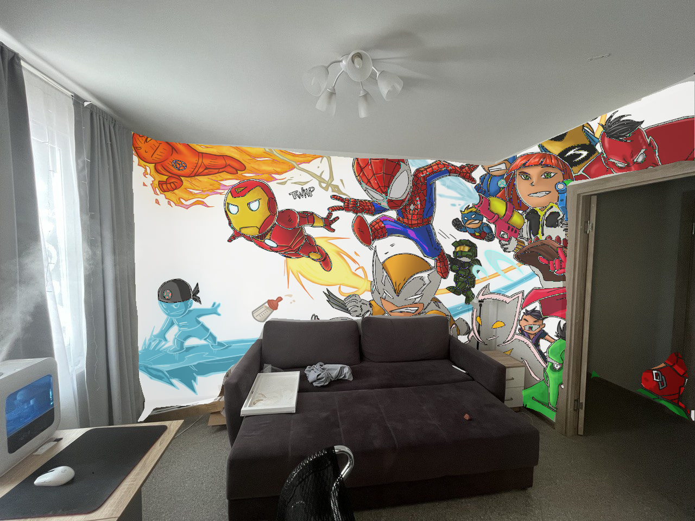

# ChangeYourWalls
Do you want to paint the walls or re-glue them altogether? But you're not quite sure they'll match the surroundings? This program allows to change the walls by the given pattern. This program aims to help with your interior update. 

# How to use
* upload a pattern into `demo/patterns` dir
* upload your interior image into `demo/source` dir
* segment the interior with `get_seg.py`
* run `main.py`, select four corners (*top left, top-right, bottom-right, bottom-left*) with Left Botton of your mouse. 
* * Click middle mouse button to apply the pattern on the selected corners
* * Click right button to delete the last selected corner (if it doesn't seem correct)

You can either select rectangle wall parts one-by-one or just select the bounding four corners to apply the pattern. 

Just play with it!



# Build a docker
```
docker build --build-arg UID="$(id -u)" --build-arg GID="$(id -g)" --build-arg UNAME="auto" -t mmseg_wall -f Dockerfile .

```

# Run docker and get segmentation mask for the image
```
docker run --rm -it --gpus all --net=host --ipc=host -e DISPLAY=$DISPLAY -v /tmp/.X11-unix:/tmp/.X11-unix -v $HOME/.Xauthority:/home/auto/.Xauthority -v $PWD:/home/auto/ mmseg_wall
```

## Download the model and config
```
mim download mmsegmentation --config pspnet_r101-d8_480x480_80k_pascal_context_59 --dest models/
```

## Get the mask
```
python3 get_seg.py --obj_class wall
```

## get the pattern
```
python3 main.py
```
results are saved in `demo/results` dir

# TODO:
* create tg bot @nikultimo
* automate corners selection
* play with various models


# References
* [MMSegmentation](https://github.com/open-mmlab/mmsegmentation)